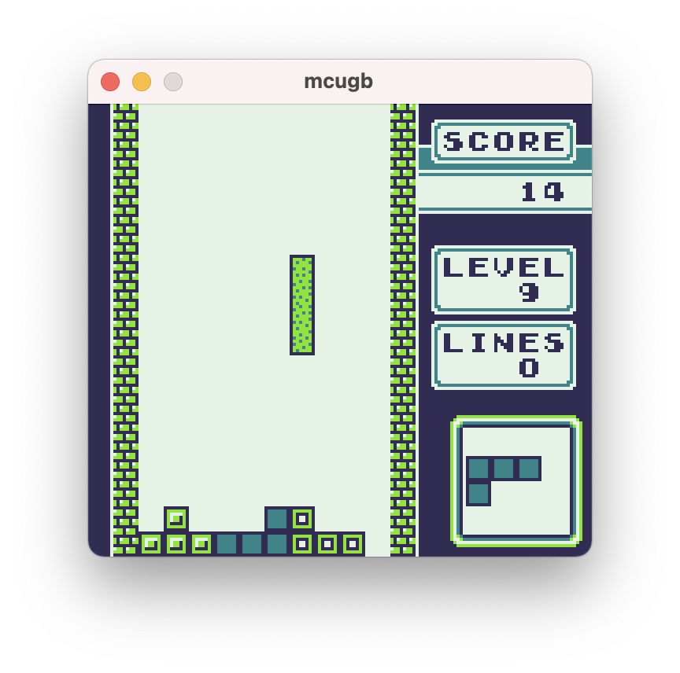

# mcugb
A GameBoy emulator written in Rust using SDL2.



### Usage:
```
cargo run ./rom.gb
```

### Keys:
* _x_ - A button
* _z_ - B button
* _c_ - Select
* _v_ - Start
* _Arrow keys_ - Directional Pad
